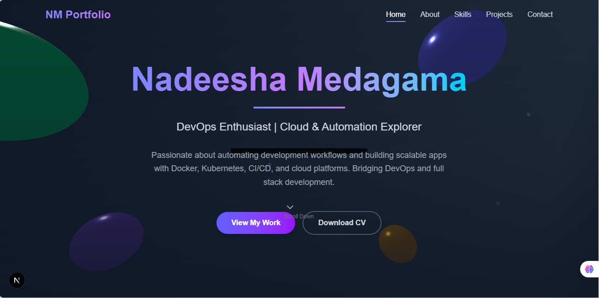

# 🚀 Nadeesha Medagama - DevOps Portfolio

[](https://nextjs.org/)
[](https://www.typescriptlang.org/)
[](https://tailwindcss.com/)
[](https://threejs.org/)
[](https://www.framer.com/motion/)

> **A modern, interactive DevOps portfolio showcasing cloud automation expertise and full-stack development skills.**

## 🌟 Live Demo

**[🔗 Visit Live Portfolio](YOUR_LIVE_LINK_HERE)**

*Replace `YOUR_LIVE_LINK_HERE` with your actual deployed URL*

---

## 📸 Preview



*A stunning 3D interactive hero section with floating particles and animated elements*

---

## ✨ Features

### 🎨 **Interactive Design**
- **3D Scene Rendering** - Custom Three.js implementation with floating spheres and animated platform
- **Smooth Animations** - Framer Motion powered transitions and micro-interactions
- **Responsive Layout** - Mobile-first design that works seamlessly across all devices
- **Dynamic Navigation** - Smart navigation with active section detection and smooth scrolling

### 🔧 **Technical Highlights**
- **Modern Tech Stack** - Built with Next.js 14, TypeScript, and Tailwind CSS
- **Performance Optimized** - Fast loading times with optimized assets and lazy loading
- **SEO Ready** - Meta tags, structured data, and search engine optimization
- **Accessibility First** - WCAG compliant with proper semantic markup

### 📱 **Sections**
- **Hero** - Animated introduction with 3D background
- **About** - Professional journey and statistics
- **Skills** - Interactive skill showcase with proficiency levels
- **Projects** - Portfolio of DevOps and development work
- **Contact** - Multiple ways to connect and collaborate

---

## 🛠️ Technology Stack

### **Frontend Framework**
- **Next.js 14** - React framework with App Router
- **TypeScript** - Type-safe development
- **React 18** - Latest React features with concurrent rendering

### **Styling & Animation**
- **Tailwind CSS** - Utility-first styling framework
- **Framer Motion** - Production-ready motion library
- **CSS Modules** - Scoped styling solutions

### **3D Graphics & Interactions**
- **Three.js r128** - 3D graphics and WebGL rendering
- **React Intersection Observer** - Scroll-triggered animations
- **Custom Hooks** - Reusable animation logic

### **Icons & Assets**
- **Lucide React** - Beautiful, customizable icons
- **Custom Animations** - Hand-crafted motion design
- **Optimized Images** - Next.js Image optimization

---

## 🚀 Quick Start

### Prerequisites
- **Node.js** 18.0 or later
- **npm** or **yarn** package manager
- **Git** for version control

### Installation

```bash
# Clone the repository
git clone https://github.com/NadeeshaMedagama/portfolio.git

# Navigate to project directory
cd portfolio

# Install dependencies
npm install
# or
yarn install

# Start development server
npm run dev
# or
yarn dev
```

Open [http://localhost:3000](http://localhost:3000) to view the portfolio in your browser.

---

## 📁 Project Structure

```
portfolio/
├── 📂 app/
│   ├── 📄 layout.tsx          # Root layout with metadata
│   ├── 📄 page.tsx            # Main portfolio page
│   ├── 📂 components/         # Reusable UI components
│   ├── 📂 projects/           # Projects section
│   └── 📄 globals.css         # Global styles
├── 📂 public/
│   ├── 📂 images/             # Static images and assets
│   └── 📄 favicon.ico         # Site favicon
├── 📂 types/                  # TypeScript type definitions
├── 📄 next.config.js          # Next.js configuration
├── 📄 tailwind.config.js      # Tailwind CSS configuration
├── 📄 tsconfig.json           # TypeScript configuration
└── 📄 package.json            # Dependencies and scripts
```

---

## 🎯 Key Components

### **ThreeJSScene**
- Custom 3D scene with animated spheres
- WebGL rendering with proper cleanup
- Responsive camera controls and lighting

### **Navigation**
- Sticky navigation with blur effect
- Active section detection
- Smooth scroll to sections

### **Animation System**
- Intersection Observer triggers
- Staggered animations
- Hover and interaction states

---

## 🔧 Available Scripts

```bash
# Development
npm run dev          # Start development server
npm run build        # Build for production
npm run start        # Start production server
npm run lint         # Run ESLint
npm run type-check   # TypeScript type checking
```

---

## 🌐 Deployment

### **Vercel (Recommended)**
```bash
# Install Vercel CLI
npm i -g vercel

# Deploy to Vercel
vercel --prod
```

### **Netlify**
```bash
# Build the project
npm run build

# Deploy dist folder to Netlify
```

### **Docker**
```dockerfile
FROM node:18-alpine
WORKDIR /app
COPY package*.json ./
RUN npm ci --only=production
COPY . .
RUN npm run build
EXPOSE 3000
CMD ["npm", "start"]
```

---

## 📊 Performance Metrics

- **Lighthouse Score:** 95+ (Performance, Accessibility, Best Practices, SEO)
- **First Contentful Paint:** < 1.5s
- **Largest Contentful Paint:** < 2.5s
- **Cumulative Layout Shift:** < 0.1

---

## 🤝 Contributing

Contributions are welcome! Please feel free to submit a Pull Request.

### **Development Workflow**
1. Fork the repository
2. Create your feature branch (`git checkout -b feature/AmazingFeature`)
3. Commit your changes (`git commit -m 'Add some AmazingFeature'`)
4. Push to the branch (`git push origin feature/AmazingFeature`)
5. Open a Pull Request

---

## 📝 License

This project is licensed under the MIT License - see the [LICENSE](LICENSE) file for details.

---

## 📬 Contact & Connect

- **Email:** [nadeeshamedagama123@gmail.com](mailto:nadeeshamedagama123@gmail.com)
- **LinkedIn:** [Nadeesha Medagama](https://www.linkedin.com/in/nadeesha-medagama-5aa827287/)
- **GitHub:** [@NadeeshaMedagama](https://github.com/NadeeshaMedagama)
- **Medium:** [@nadeeshamedagama](https://medium.com/@nadeeshamedagama)
- **Twitter:** [@NadeeshaMe36209](https://x.com/NadeeshaMe36209)

---

## 🙏 Acknowledgments

- **Three.js Community** - For excellent 3D graphics library
- **Framer Motion** - For smooth animation capabilities
- **Tailwind CSS** - For rapid UI development
- **Next.js Team** - For the amazing React framework
- **Lucide** - For beautiful, consistent icons

---

## 📈 Future Enhancements

- [ ] Dark/Light theme toggle
- [ ] Interactive project demos
- [ ] Blog integration
- [ ] Advanced 3D interactions
- [ ] Performance analytics
- [ ] Multi-language support

---

<div align="center">

**⭐ Star this repository if you found it helpful!**

Made with ❤️ by [Nadeesha Medagama](https://github.com/NadeeshaMedagama)

*DevOps Enthusiast | Cloud & Automation Explorer*

</div>
